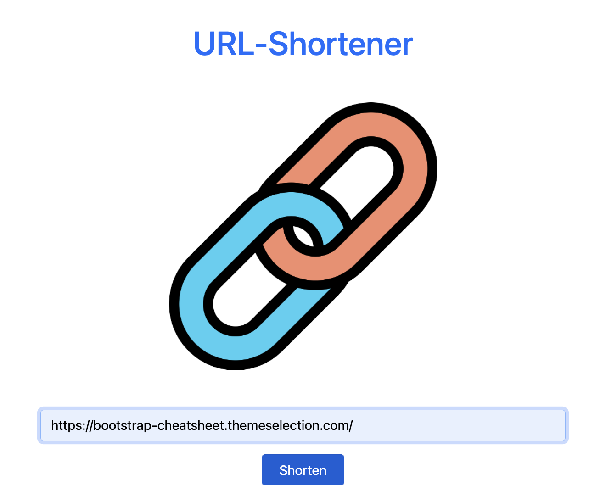

# ****URL-Shortener****

## 📖 Introduction
****URL-Shortener**** can shorten a URL or reduce a link. 



## 🎮 Features

- Users can type a URL into a shorter URL
- Users can click the link of the shorter URL to go to the website
- Users can click the **Copy** button to copy the shorter URL
- Users can click the **Back** button to the home page and produce a new shorter URL

## 🛠️ Installation

```
# Clone this repository
$ git clone https://github.com/Lilynews/url-shortner.git

# Confirmed the terminal is at the project
cd url-shortener

# Project setup
$ npm install

# add the file of .env, and set up the DB_URL
MONGODB_URL=mongodb+srv://<account>:<password>@cluster0.<xxxxx>.mongodb.net/<table>?retryWrites=true&w=majority

# Before active project, need to create seeder in DB, type
npm run seed

after setup, type
$ npm run start

# if the message shows like below, please open the web page and type the URL: http://localhost:3000, and you can enter this website.
"App is running on http://localhost:3000"

# To stop the project
ctrl + c
```

## 👩🏻‍💻 Tech/framework used

- VScode 1.73.1
- Node.js 14.16.0
- Express 4.17.1
- Express-Handlebars 4.0.2
- Mongoose: 5.9.7

## 🗺️ Roadmap

- [x]  Shorten-URL
- [x]  Copy button for the link
- [ ]  product QR code
- [ ]  show all the links of URLs